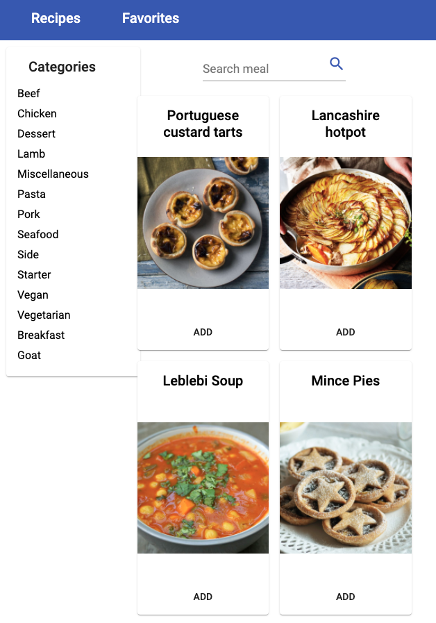

# Angular Recipe App



Angular Recipe App is (exactly as it sounds) a recipe app built in Angular (using Angular Material) as a school project. It is possible to search for a recipe or simply sort it by category.

## Installation

Use npm package manager (https://docs.npmjs.com/downloading-and-installing-node-js-and-npm)

Clone the repo and run

```bash
npm install
```

to get all dependencies

## The original task

- User can click a recipe to see all information (own route)
- Save recipes to temporary list
  - Possible to delete recipes from this list
  - Possible to view this list (own route)
- Filter recipes on different categories
- Show a list of recipes

### task requirements

- Angular 11
- Use external API
- Possible to use on mobile phone

## Deploy to Heroku

https://devcenter.heroku.com/articles/build-docker-images-heroku-yml

1. Make sure the backend is set up first

2. Create a Heroku account and login + install Heroku CLI

```bash
brew install heroku
```

3. Create new Heroku dyno and push it to Heroku

```bash
heroku create josjo-recipe-frontend
heroku stack:set container
git push heroku main
```
